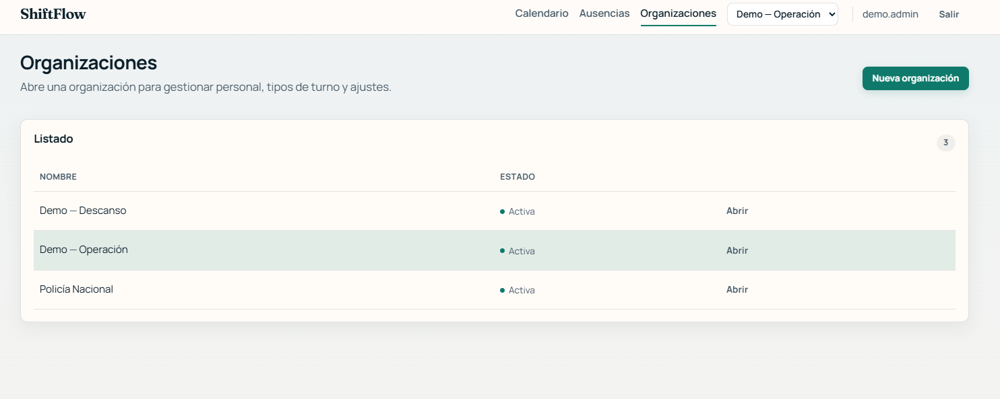
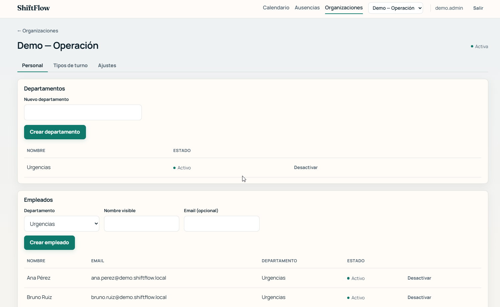
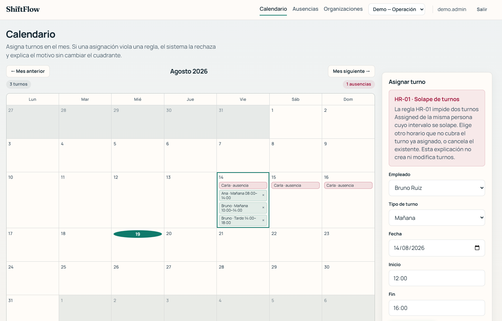

<!--
Uso: abrir en VS Code/Cursor con extensión Marp, o:
npx --yes @marp-team/marp-cli docs/presentation/mvp-0.1/product-slides.md --pdf -o docs/presentation/mvp-0.1/export/product-slides.pdf

14 láminas. No cubren SDAF, puertas ni ADRs: eso está en el vídeo.
Capturas en captures/ (01–07), verificadas 2026-08-19.
-->

<style>
section { font-size: 26px; }
table { font-size: 21px; }
pre { font-size: 18px; }
footer { font-size: 15px; opacity: .65; }
h1 { font-size: 40px; }
blockquote { font-size: 24px; }
img { object-fit: contain; }
.shots {
  display: grid;
  grid-template-columns: 1fr 1fr;
  gap: 0.7rem;
  align-items: start;
  margin-top: 0.4rem;
}
.shots img { width: 100%; max-height: 340px; }
.shot-one { margin-top: 0.35rem; text-align: center; }
.shot-one img { max-height: 390px; max-width: 100%; }
</style>

# ShiftFlow `mvp-0.1`

## Planificación de turnos demostrable en local

Un evaluador recorre el flujo crítico **en menos de 15 minutos**,
sin cuenta en la nube.

Etiqueta `mvp-0.1` · 17 ago 2026

<!-- 1 · portada -->

---

<!-- footer: "Producto · el problema" -->

# El problema

Equipos de personal necesitan un **cuadrante mensual** que se pueda
construir a mano y que **rechace lo ilegal** antes de guardarlo.

Hoy ese trabajo suele vivir en hojas de cálculo: el solape, la ausencia
y el descanso mínimo se descubren tarde, o no se descubren.

**ShiftFlow** es una consola operativa para:

1. Tener maestros (organización, personal, tipos de turno).
2. Asignar un turno en un calendario mensual.
3. Ver **por qué** una asignación no es válida, en el momento.

<!-- 2 -->

---

<!-- footer: "Producto · propuesta de valor" -->

# Qué entrega este corte

| El usuario puede | Resultado observable |
|------------------|----------------------|
| Administrar organizaciones, departamentos, empleados y tipos de turno | Inventario usable en la Web |
| Abrir un **calendario mensual** y asignar un turno | Turno visible en el día |
| Intentar un solape, un hueco con ausencia o un descanso corto | El sistema **rechaza** y explica |
| Registrar una ausencia | Bloquea nuevas asignaciones en ese intervalo |
| Arrancar todo en su máquina | API + Web + PostgreSQL con un comando |

No genera cuadrantes. No optimiza. **Valida y explica.**

<!-- 3 -->

---

<!-- footer: "Producto · alcance" -->

# Qué entra y qué no

**Entra**

Maestros · calendario mensual · asignación **manual** · tres reglas duras
(solape, ausencia, descanso mínimo) · ausencias · acceso con rol de administrador
· API REST · cliente Web único · arranque local

**No entra** (declarado, no omitido)

Optimización automática · IA que escribe el cuadrante · app nativa o móvil
· colaboración en tiempo real · informes avanzados · nube como único camino
de evaluación · reglas expertas del dominio de origen (pares/impares, bolsa
mensual, cuotas nocturnas)

Esas reglas expertas **siguen documentadas**; no están implementadas.

<!-- 4 -->

---

<!-- footer: "Puente C-PRE · arquitectura a alto nivel; detalle en el vídeo" -->

# Cómo está montado (mapa)

Cinco piezas. Cada una existe para una restricción de producto.

| Pieza | Para qué |
|-------|----------|
| **.NET 10** + ASP.NET Core | Un solo ecosistema para API, Web y tests |
| **Blazor Web App** | Una sola superficie de usuario; sin app nativa en este corte |
| **PostgreSQL** + EF Core | Persistencia relacional con invariantes |
| **.NET Aspire** | Un comando levanta base, API y Web **en local** |
| **Motor de reglas** (3 duras) + explicación | Rechaza lo inválido; un adaptador **explica** el rechazo |

La inteligencia artificial **no escribe** en el cuadrante.

**Decisiones, fronteras y método:** vídeo de arquitectura (8–10 min).

<!-- 5 · puente obligatorio -->

---

<!-- footer: "Producto · SPEC-PRD-002 · runbook §3.2" -->

# Cómo se demuestra

Dos caminos, ambos en **menos de 15 minutos**.

| Camino | Qué hace el evaluador | Cuándo |
|--------|----------------------|--------|
| **Catálogo** | Login → elegir `Demo — Operación` o `Demo — Descanso` en la barra → provocar un rechazo | Recorrido rápido con datos ya sembrados |
| **A mano** | Crear organización, departamento, empleado y tipo → asignar OK → solape → ausencia que bloquea | Demuestra que el alta no depende del seed |

| Organización de vitrina | Para ver |
|-------------------------|---------|
| `Demo — Operación` | Turno válido (Ana) · solape (Bruno) · ausencia (Carla) |
| `Demo — Descanso` | Descanso mínimo (Diego, umbral 660 min) |

<!-- 6 -->

---

<!-- footer: "Journey · pasos 1–3 · /login · / · barra" -->

# Entrar y operar

Usuario demo: **`demo.admin`**. Contraseña en el [runbook](../../runbook-local.md).
Org activa en la barra (Calendario y Ausencias la comparten).

<div class="shots">


</div>

<!-- 7 -->

---

<!-- footer: "Journey · pasos 1–3 · /organizations · detalle por pestañas" -->

# Maestros: inventario antes que alta

El listado manda; el alta se abre con «Nueva…». Detalle por pestañas:
**Personal** (inicial) · Tipos de turno · Ajustes.

<div class="shots">





</div>

<!-- 8 -->

---

<!-- footer: "Journey · pasos 4–5 · /calendar" -->

# Calendario: asignar un turno válido

La **grilla mensual** manda; asignar vive en el panel. Un clic en el día rellena la fecha.
Ana, 08:00–14:00 UTC, queda en el día (en esta vitrina: 14 ago).

<div class="shot-one">


</div>

<!-- 9 -->

---

<!-- footer: "Journey · pasos 6–8 · HR-01 / HR-02 / HR-03" -->

# Un rechazo, explicado

El dominio bloquea **antes** de persistir. La UI muestra `title` / `body` junto al panel.
En la foto: Bruno, 12:00–16:00 UTC el 14 ago → **HR-01** solape. También: ausencia (Carla) y descanso mínimo (Diego).

<div class="shot-one">



</div>

<!-- 10 -->

---

<!-- footer: "Journey · paso 7 · /leaves" -->

# Ausencias que bloquean

El inventario manda; alta con «Registrar…». Una ausencia **activa** rechaza
cualquier asignación que toque el intervalo (Carla, 14–16 ago, en la foto).

<div class="shot-one">


</div>

<!-- 11 -->

---

<!-- footer: "Producto · C-LOC · runbook §3" -->

# Arranque en frío

Prerrequisitos: SDK **.NET 10** y Docker Desktop.

```powershell
dotnet restore ShiftFlow.sln
dotnet tool restore
dotnet run --project src/ShiftFlow.AppHost --launch-profile https
```

Aspire levanta PostgreSQL (puerto **5433**) + API + Web. Comprobación: `GET /api/status` → `"status":"ok"`.

El perfil `https` deja el entorno en Development: el catálogo de demo se siembra solo.

Guía completa, contingencia Compose y reset de volumen: [docs/runbook-local.md](../../runbook-local.md).

<!-- 12 -->

---

<!-- footer: "Evolución · handbook/04 · sprints 0–3" -->

# Camino 1–22 agosto y qué queda

| Etapa | Lo que se puede enseñar |
|-------|-------------------------|
| Fundación | Repositorio y runtime; aún sin flujo de negocio |
| Núcleo | Login, organizaciones, personal, tipos de turno |
| Planificación | Calendario, tres reglas, ausencias |
| Cierre | Explicación del rechazo, jerarquía de pantallas, freeze y etiqueta |

**Después de este corte (dirección, sin fecha):** más reglas, cliente híbrido si el Web aguanta, colaboración en vivo, generación asistida **con confirmación humana**, optimización.

El método con el que se construyó —especificaciones que gobiernan a los agentes— está en el **vídeo**, no en estas láminas.

<!-- 13 -->

---

<!-- footer: "" -->

# Para operar y para evaluar

| Qué quieres | Dónde |
|-------------|--------|
| Recorrer el producto | Esta deck + aplicación en local |
| Levantar el stack | [docs/runbook-local.md](../../runbook-local.md) |
| Entender las decisiones | Vídeo de arquitectura y gobernanza (8–10 min) · [guion](guion-video-arquitectura.md) |

**ShiftFlow `mvp-0.1`:** asignar a mano, rechazar a tiempo, explicar el rechazo.

<!-- 14 · cierre -->
